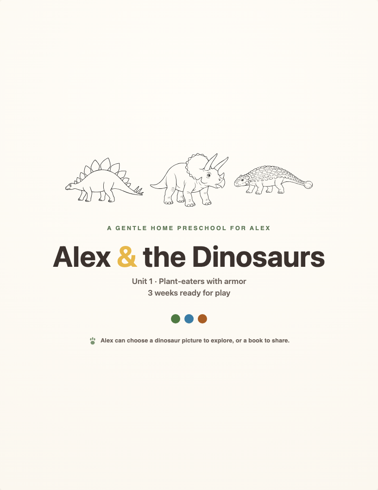
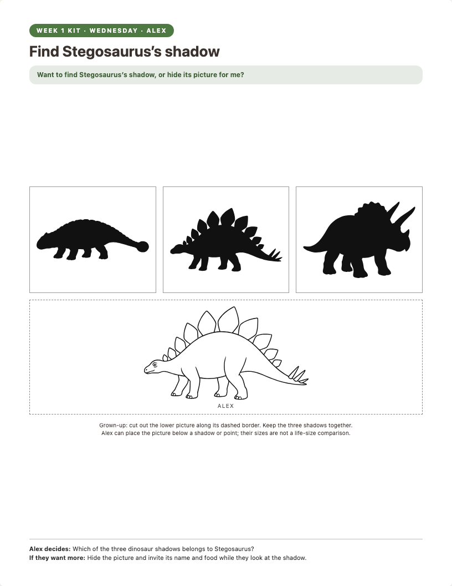
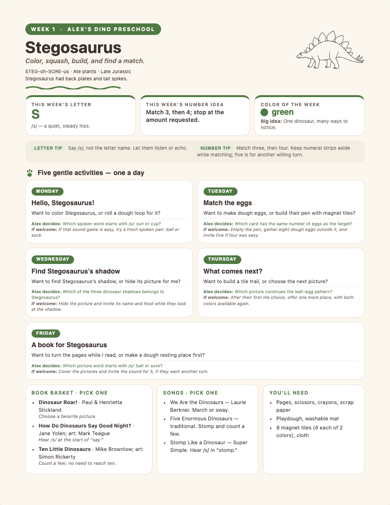
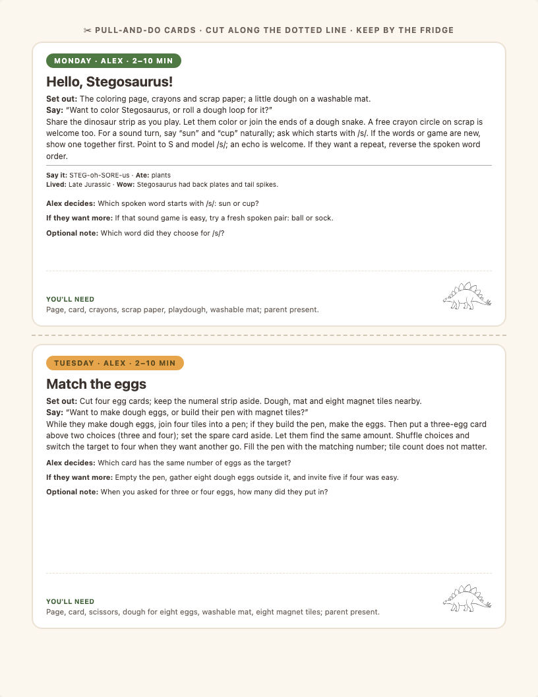

# Home preschool

One dinosaur a week, one page a day. A print-at-home preschool kit for a
three-year-old, with the pedagogy written down and every page traced to the skill
it serves.

<p align="center">
  
  &nbsp;
  
</p>

## What you get

- **Unit 1: three weeks, fifteen days.** Each day is one black-and-white play page
  and one parent card. The card gives the setup, two invitations ("want to color
  Stegosaurus, or roll a dough loop beside it?"), the decision only the child can
  make, a harder rung for when they want more, and one optional question.
- **A parent binder.** How to use the kit, the two skill ladders, and one page per
  week with the five activities, a book basket, songs and the materials list.
- **The curriculum behind it.** Five strands (reading, number, language, motor,
  thinking), each with milestones and a two-minute check, and a plan tree where
  every activity names the milestone it serves.
- Weeks 4–8 are planned at the unit level, not built yet.

<p align="center">
  
  &nbsp;
  
</p>

## Print it, no setup

The PDFs in [printables/](printables/) are ready to go. Print on US Letter,
single-sided, at actual size (100%), with browser headers and footers off.

1. Read page 2 of `binder.pdf`: it explains the whole approach in one page.
2. Print `kit-week-01.pdf`. Pages 1–5 are the play pages, one per day; pages 6–8
   are the parent cards. Cut the cards out and keep the day's card by the fridge.
3. Set out the page, play nearby for 2–10 minutes, stop when your child pushes
   back. One book and one roar counts as a good day.

Those PDFs say "Alex". To print your own child's name, see the next section.

## Make it yours

You need Node.js 20 or newer.

```sh
git clone https://github.com/itsHabib/home-preschool.git
cd home-preschool
npm install
npx playwright install chromium   # once; renders the PDFs
```

Edit `child.json`:

```json
{ "name": "Mia", "pronouns": "she" }
```

`pronouns` is `he`, `she` or `they`. Every page and card is written with tokens,
so "if she wants more" and "if they want more" both come out right. Then:

```sh
npm run build   # writes binder.html and kit-week-01..03.html; open them in a browser to print
npm run pdf     # renders them to printables/
```

Before week 1, run the ten-minute [level check](docs/level-check.md). Unit 1
assumes a child who counts 1–4 objects with meaning, knows no letter sounds yet,
and cannot yet draw a closed circle. The check tells you where to start if yours is
somewhere else.

## How it is built

```text
weeks-v2/week-0N.json  ──▶ assemble-content.mjs ──▶ content.json
                                                       │
docs/plan/ (the tree) ──▶ check-tree.mjs, check-content.mjs
                                                       │
child.json ──▶ child.mjs ──▶ build.mjs ──▶ binder.html ─┤
                          ──▶ build-kit.mjs ──▶ kit-week-0N.html ──▶ scripts/render-pdf.mjs ──▶ printables/*.pdf
```

- **The plan tree** ([docs/plan/](docs/plan/)) goes unit → week → activity, one
  small file per node with the same seven sections. `check-tree.mjs` fails if an
  activity serves no milestone, a week misses a strand, a parent does not list its
  child, or a milestone has fewer than three activities behind it.
- **Content checks** (`check-content.mjs`): every day has two invitations, a
  decision, a harder rung, a 2–10 minute window, dough and magnet-tile play at
  least twice a week, three real books and three real songs, and matches its plan
  node exactly.
- **Template checks** (`templates.test.mjs`): every page type renders, and an
  unsolvable pattern or an ambiguous dinosaur drawing fails before a parent can
  print it.
- **Print checks** (`npm run verify:print`): Chromium renders every page at US
  Letter in both screen and print mode and fails on anything that overflows the
  page.
- **Art** ([art/](art/)): the dinosaur, egg, leaf and meat drawings are
  image-model line art, checked by a person for the defining features, then traced
  to SVG. The small props are hand-drawn. `art/README.md` has the prompts.

`npm run check` runs all of it in about a second.

## Adding a week

1. Write the plan nodes: `docs/plan/L4/W4.md` and five `docs/plan/L5/W4-D1.md` …
   `W4-D5.md`, using the schema at the bottom of
   [docs/curriculum-tree.md](docs/curriculum-tree.md).
2. Write `weeks-v2/week-04.json` in the shape of `week-01.json`, with the name and
   pronoun tokens (`{{name}}`, `{{they}}`, `want{{s}}`) where the text mentions the
   child.
3. Add the dinosaur's line art as `art/<id>.svg` and `art/<id>-shadow.svg`.
4. Widen the week pattern in `assemble-content.mjs` and the expected letters in
   `check-content.mjs`; both pin Unit 1 on purpose.
5. `npm run check && npm run build && npm run verify:print`.

To swap the theme entirely, keep the ladders and the templates and change the
costume: new art, new weeks, same strands.

## Where it comes from

A parent built this with AI agents for one dinosaur-obsessed three-year-old, ran
it at home, and rewrote it after the first weeks showed the pages were too easy
and never asked the child to decide anything. The reading strand follows synthetic
phonics (the S-A-T-P-I-N sounds first); the number strand builds counting with
meaning before numerals. It is a parent's synthesis, not a published program, and
it is not a substitute for preschool. It is a way to spend ten good minutes a day.

The plan tree was written one node at a time by agents and checked by a person;
the dinosaur facts, books and songs are sourced in [docs/sources.md](docs/sources.md).

## Read more

- [CURRICULUM.md](CURRICULUM.md): the pedagogy and the five strands.
- [docs/curriculum-tree.md](docs/curriculum-tree.md): the vision, the milestones
  with their checks and target ages, and the plan node schema.
- [docs/design.md](docs/design.md): why the weeks look like this, and what the
  first version got wrong.
- [docs/level-check.md](docs/level-check.md): the ten-minute starting-point check.
- [docs/sources.md](docs/sources.md): every fact, book and song, with its source.

## License

[MIT](LICENSE). Print it, copy it, change it, share it.
